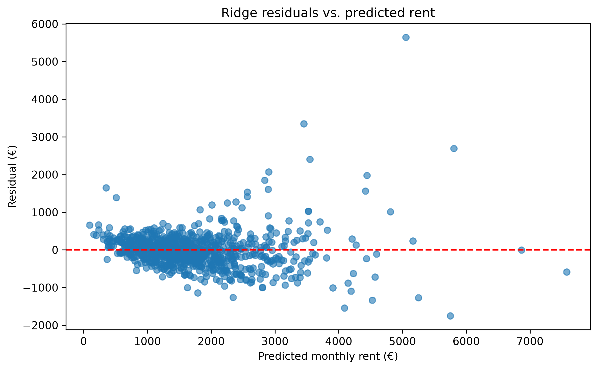

# Error Analysis and Feature Effects

## Overview

One overall metric cannot explain where a model struggles. Error analysis examines individual predictions, category-level patterns, residual plots, outliers, and learned coefficients.

## Residuals

The project defines a residual as:

```text
residual = actual rent - predicted rent
```

- Positive residual: the model underpredicted.
- Negative residual: the model overpredicted.
- Absolute error: the size of the mistake regardless of direction.

MAE averages absolute errors into one number. Residual analysis keeps the individual errors visible.

## Investigating a suspicious target

The original largest error came from index `213625`:

| Field | Value |
| --- | ---: |
| Recorded `baseRent` | €20,100 |
| `serviceCharge` | €140 |
| `heatingCosts` | €150 |
| `totalRent` | €2,390 |

The supporting fields implied:

```text
2,390 - 140 - 150 = €2,100
```

The exact €18,000 inconsistency strongly suggested an extra zero in the target. The row was excluded rather than corrected because the intended value was not authoritative.

This issue was discovered by inspecting the original test errors. The corrected results are therefore transparent data-quality-corrected results, not evaluation on a completely fresh test set.

## Category-level performance

Errors varied across neighbourhoods. Altstadt and Lehel had MAE values above €600 in the analyzed split, while the overall baseline Ridge test MAE was approximately €309.

Category results must be interpreted with their sample sizes. A neighbourhood with 11 test listings gives a less stable estimate than one with 84.

## Feature effects

Ridge coefficients show how transformed inputs push predictions up or down while other features are held fixed.

Examples from the baseline Ridge model:

- `livingSpace`: approximately `+€975` for an increase of one training-set standard deviation, not one additional square metre;
- `noRooms`: approximately `-€133` conditionally, after controlling for living space and other inputs;
- Lehel, Altstadt, Maxvorstadt, and Schwabing had positive neighbourhood effects relative to the omitted reference category.

Coefficients describe associations in the fitted data. They do not prove causation, and correlated features can redistribute weight among one another.

For example, the model may learn that apartments in Lehel are associated with higher rent. This does not prove that being in Lehel alone causes rent to increase by exactly that amount: the area may also be linked to unmeasured factors such as the exact street, renovation quality, furnishing, or nearby amenities.

## Residual spread

The residual plot showed that ordinary-rent predictions were relatively concentrated around zero, while errors became much more dispersed for expensive listings.



This changing error variance is **heteroscedasticity**. It indicates that premium and unusual apartments are less predictable using the available features.

## Controlled feature experiment

The enhanced Ridge model added construction year, floor, condition, interior quality, and several amenities.

| Metric | Baseline Ridge | Enhanced Ridge |
| --- | ---: | ---: |
| Test MAE | €308.84 | €289.13 |
| Test RMSE | €479.18 | €456.29 |
| Test R² | 0.764 | 0.786 |
| High-rent MAE | €739.74 | €702.53 |

The additional property information improved every reported metric, although expensive listings remained much harder to predict.

## Key takeaway

Error analysis turns a score into an explanation: it reveals data problems, weak subgroups, missing information, and the limits of what a model has learned.

## Related notes

- [Rental Prediction Problem and Data Preparation](Rental%20Prediction%20Problem%20and%20Data%20Preparation.md)
- [Cross-Validation, Regularization, and Model Selection](Cross-Validation%2C%20Regularization%2C%20and%20Model%20Selection.md)
- [Model Serving with CLI and Streamlit](Model%20Serving%20with%20CLI%20and%20Streamlit.md)