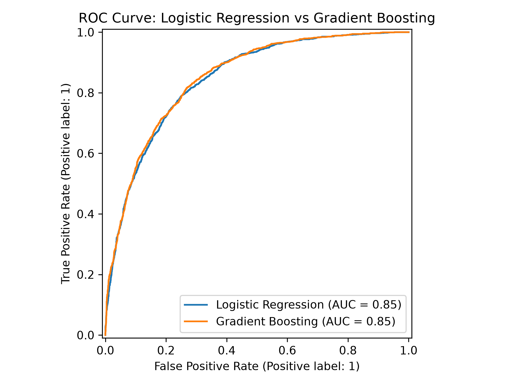
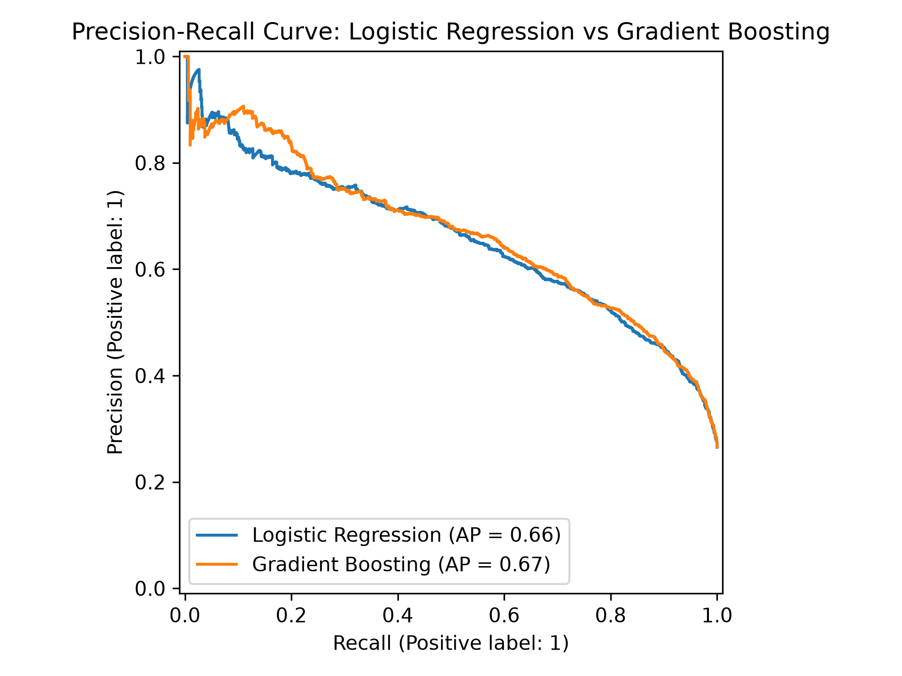
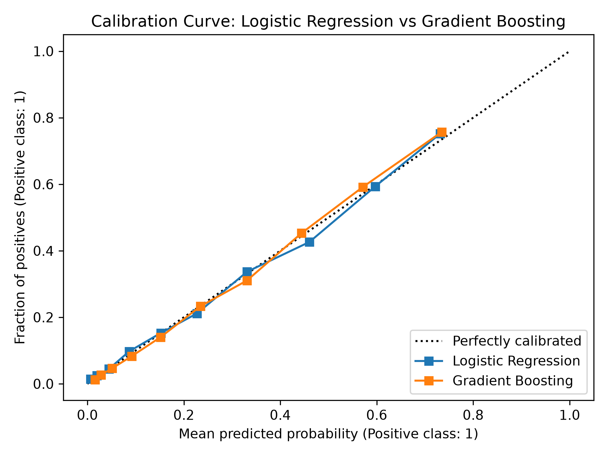

# Ranking Quality, Calibration, and Error Analysis

## Ranking quality versus probability quality

A classifier’s probabilities can be evaluated in two different ways.

Ranking quality asks:

```text
Does the model generally rank churners
above non-churners?
```

Probability quality asks:

```text
Do the numerical probability values
match observed frequencies?
```

A model can rank customers well while still producing probabilities that are too high or too low.

## Ranking metrics

The project used:

* ROC-AUC;
* Average Precision;
* ROC curves;
* precision-recall curves.

Out-of-fold training results were:

| Model               | ROC-AUC | Average Precision |
| ------------------- | ------: | ----------------: |
| Logistic Regression |  0.8456 |            0.6583 |
| Gradient Boosting   |  0.8500 |            0.6686 |

Gradient Boosting was slightly stronger, but the difference was small.

## ROC curve

The ROC curve shows the relationship between:

* true positive rate, which is the same as recall;
* false positive rate.

It measures how well a model separates churners from non-churners across classification thresholds.



Both models achieved a ROC-AUC of approximately `0.85`, and their curves are nearly identical. This indicates that both models rank churners above non-churners reasonably well.

Gradient Boosting achieved the slightly higher exact ROC-AUC:

```text
Logistic Regression: 0.8456
Gradient Boosting:    0.8500
```

However, ROC-AUC considers both classes and can appear strong even when the positive class is less common. That is why the precision-recall curve is also important for this churn problem.

## Why the precision-recall curve matters

Churn is the minority class.

The precision-recall curve focuses directly on performance for the positive churn class. It shows the trade-off that occurs as the classification threshold changes:

```text
higher recall
<-> more churners caught
<-> usually lower precision
```



The curves are close, but Gradient Boosting maintained slightly better precision-recall performance overall.

Its Average Precision was also slightly higher:

```text
Logistic Regression: 0.6583
Gradient Boosting:    0.6686
```

Average Precision summarizes precision-recall performance across classification thresholds.

## Calibration

Calibration asks whether predicted probabilities behave like real frequencies.

For example:

```text
Among customers assigned approximately 0.70 churn probability,
do around 70% actually churn?
```

The project used reliability diagrams and Brier scores.

| Model               | Brier score |
| ------------------- | ----------: |
| Logistic Regression |      0.1351 |
| Gradient Boosting   |      0.1331 |

Lower Brier scores indicate better overall probability quality.

The calibration curve compares:

```text
mean predicted churn probability
against
observed fraction of customers who churned
```



The dotted diagonal represents perfect calibration:

```text
predicted probability = observed churn rate
```

A point below the diagonal means the model predicted a probability higher than the observed churn rate, so it was overconfident in that region.

A point above the diagonal means the observed churn rate was higher than predicted, so the model was underconfident in that region.

Both models stayed reasonably close to the diagonal. Gradient Boosting also achieved the slightly lower Brier score, but the difference between the two models was small.

Explicit recalibration was therefore not applied.

This does not mean the probabilities are perfect. It means the analysis did not show enough miscalibration to justify adding another calibration stage for this learning project.

## Out-of-fold predictions

The analysis used out-of-fold training probabilities.

Each customer’s probability came from a model that had not trained on that customer:

```text
split training data into folds
-> hold out one fold
-> train on the other folds
-> predict the held-out fold
-> repeat for every fold
```

This produces development predictions without consuming the final test set.

The out-of-fold probabilities could therefore be used for:

* comparing candidate models;
* analyzing calibration;
* examining errors;
* selecting a business-cost-aware threshold.

The held-out test set remained separate for the final evaluation.

## Error analysis

At threshold `0.50`, Gradient Boosting’s out-of-fold predictions contained:

| Error type      | Count |
| --------------- | ----: |
| Correct         | 4,544 |
| False negatives |   706 |
| False positives |   384 |

The model made more false negatives than false positives at this threshold.

For this churn problem:

* a false positive means the model predicted churn, but the customer stayed;
* a false negative means the model predicted non-churn, but the customer churned.

False positives had:

* the shortest average tenure;
* the highest average monthly charges;
* relatively low average total charges.

This suggests that the model strongly associates short tenure and high monthly charges with churn risk. Some customers with those risk signals still stayed, so they became false positives.

False negatives were less extreme. Their feature values sometimes did not produce probabilities high enough to cross the `0.50` threshold even though they eventually churned.

This error pattern helped explain why a lower threshold could be appropriate when missing a real churner is considered more expensive than contacting an extra customer.

## Key takeaway

A complete evaluation examines ranking quality, probability calibration, threshold behavior, and actual error patterns.

ROC-AUC and Average Precision measure how well customers are ranked. The Brier score and calibration curve examine the probability values themselves. Error analysis then connects those measurements to the kinds of mistakes the model makes.

No single metric explains all four.

## Related notes

* [Classification Metrics, Thresholds, and Class Imbalance](Classification%20Metrics%2C%20Thresholds%2C%20and%20Class%20Imbalance.md)
* [Business-Cost-Aware Threshold Selection](Business-Cost-Aware%20Threshold%20Selection.md)
