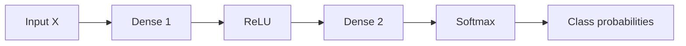

# Dense Layers: Project 7's Chain Rule at Neural-Network Scale

The `Dense` class implements the basic fully connected layer used by the neural network. It performs an affine transformation:

```text
Z = XW + b
```

The word *dense* means that every input feature is connected to every output neuron through a learned weight.

## Why a dense layer is needed

An image is initially represented as pixels. For MNIST, a `28 × 28` image is flattened into `784` input features.

The network transforms these 784 values into useful intermediate features, then transforms those features into scores for the ten possible digits.

```text
784 pixel features → Dense 1 → 32 hidden features
                    → ReLU
                    → Dense 2 → 10 output scores
```

## Shapes

For a batch of examples, use:

```text
B = batch size
F = number of input features
H = number of output neurons
```

| Value | Shape | Meaning |
|---|---:|---|
| `X` | `(B, F)` | Input batch |
| `W` | `(F, H)` | One weight per input-output connection |
| `b` | `(H,)` | One bias per output neuron |
| `Z` | `(B, H)` | Layer output for the batch |
| `dZ` | `(B, H)` | Upstream gradient entering the layer |
| `dW` | `(F, H)` | Gradient for the weights |
| `db` | `(H,)` | Gradient for the biases |
| `dX` | `(B, F)` | Gradient passed to the previous layer |

The same class works whether `X` is the raw input or an activation from a previous layer:

```text
X → Dense 1 → Z1 → ReLU → A1 → Dense 2 → Z2
```

`Dense 1` receives the input pixels. `Dense 2` receives `A1`, the hidden activation produced by ReLU.

## Forward pass

```python
def forward(self, inputs):
    self.inputs = inputs
    return inputs @ self.weights + self.biases
```

This implements:

```text
Z = XW + b
```

The layer stores `inputs` because the backward pass needs the original `X` to calculate `dW`.

### Why the multiplication order is `X @ W`

Suppose:

```text
X has shape (B, F)
W has shape (F, H)
```

The inner dimensions match:

```text
(B, F) @ (F, H) = (B, H)
```

The result contains one row per example and one column per output neuron. Matrix multiplication is not commutative, so `W @ X` would generally have the wrong shape and represent a different operation.

## Project 7 (automatic-differentiation-engine) connection

The link for it's repository is: https://github.com/nahom-mersha/automatic-differentiation-engine

In Project 7, a scalar multiplication-and-addition node could be written as:

```text
z = u × w + b
```

During backpropagation, the node receives an upstream gradient:

```text
dz = ∂L/∂z
```

Each parent receives an accumulated gradient:

```text
u.grad += dz × ∂z/∂u
w.grad += dz × ∂z/∂w
b.grad += dz × ∂z/∂b
```

The local derivatives are:

```text
∂z/∂u = w
∂z/∂w = u
∂z/∂b = 1
```

The dense layer applies the same chain rule to many examples, input features, and output neurons at once.

## Backward pass

The gradient entering the layer is commonly named `output_gradient` because it is the gradient of the loss with respect to the layer's output:

```text
output_gradient = dZ = ∂L/∂Z
```

It is also called the **upstream gradient** because it came from the layers closer to the loss.

The dense-layer formulas are:

```text
dW = Xᵀ @ dZ
db = sum(dZ over the batch)
dX = dZ @ Wᵀ
```

In code:

```python
def backward(self, output_gradient):
    self.weights_gradient = self.inputs.T @ output_gradient
    self.biases_gradient = output_gradient.sum(axis=0)
    input_gradient = output_gradient @ self.weights.T
    return input_gradient
```

### `dW = Xᵀ @ dZ`

Shapes:

```text
Xᵀ:  (F, B)
dZ:  (B, H)
dW:  (F, H)
```

This calculates how much each weight contributed to the loss. The batch dimension `B` is multiplied away, so contributions from all examples are accumulated.

For one scalar connection, this is the same idea as:

```text
weight_gradient += input_value × output_gradient
```

The matrix multiplication performs that operation for every weight and every example simultaneously.

### `db = dZ.sum(axis=0)`

Each output neuron has one bias. Because the same bias is added to every row in the batch, its gradient is the sum of the output gradients across examples.

If `dZ` has shape `(B, H)`, then:

```python
dZ.sum(axis=0)
```

has shape `(H,)`. `axis=0` means collapse the rows and keep one value for each output column.

### `dX = dZ @ W.T`

Shapes:

```text
dZ: (B, H)
Wᵀ: (H, F)
dX: (B, F)
```

This returns the gradient with respect to the layer input. It is the gradient passed to the previous layer.

The transpose is required because the original forward operation used `X @ W`. The backward operation reverses the relationship between the dimensions.

## The complete model



Forward propagation:

```text
X → Dense 1 → Z1 → ReLU → A1 → Dense 2 → Z2 → Softmax → P
```

Backward propagation:

```text
loss → softmax/cross-entropy → Dense 2 → ReLU → Dense 1 → input
```

At every step:

1. The layer receives an upstream gradient.
2. It applies its local derivative.
3. It calculates gradients for its parameters.
4. It returns a gradient to the previous layer.

## How `Dense` is used by the model

The Streamlit app does not directly call `Dense`:

```python
model.forward(inputs)
```

Instead, `MulticlassClassifier` creates and owns two dense layers:

```python
self.dense1 = Dense(input_size=784, output_size=32)
self.dense2 = Dense(input_size=32, output_size=10)
```

The model coordinates them:

```text
MulticlassClassifier
├── dense1
├── ReLU
└── dense2
```

The `Dense` class is therefore a reusable building block. The model class assembles the blocks into a complete neural network, and the Streamlit app uses the model's public interface.

## Parameter update

After backpropagation, the layer updates its parameters:

```python
self.weights -= learning_rate * self.weights_gradient
self.biases -= learning_rate * self.biases_gradient
```

This is gradient descent. The gradients point in the direction that increases the loss, so subtracting them moves the parameters toward lower loss.

```text
new parameter = old parameter − learning rate × gradient
```

## Initialization

The weights use He initialization:

```python
rng.standard_normal((input_size, output_size)) * np.sqrt(
    2.0 / input_size
)
```

This gives the weights a scale that is useful before a ReLU activation. Biases start at zero because the weights already provide the initial variation needed for the neurons.

## What to remember

```text
Dense forward:
    Z = XW + b

Dense backward:
    dW = Xᵀ @ dZ
    db = dZ.sum(axis=0)
    dX = dZ @ Wᵀ
```

The most important conceptual connection is:

```text
Project 7:
    one scalar node, one local derivative, one upstream gradient

Project 8:
    many values at once, vectorized local derivatives,
    matrix gradients, and the same chain rule
```

The dense layer is not a new kind of calculus. It is Project 7's reverse-mode chain rule expressed efficiently with arrays and matrices.
